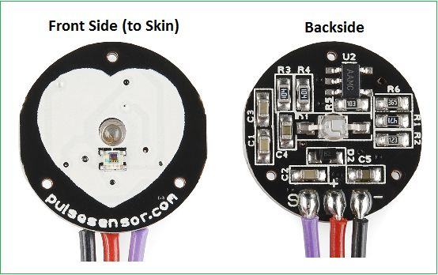

# Senior-Saviour

The project is to develop an intelligent health and hazard monitoring system for the elderly people within our supervision. 

In this busy world to make our living and for other reasons young people often have to stay away from their home. In their absence the elderly people at their home kept unattended. There is a risk of their non well being or even facing any fatal accident. One cannot be present with them physically all the time. So to keep an eye on the elderly people for their safety all the time this project is developed that can alert through an android application about any immediate or upcoming dangers to them.


# Software Used:
1. Android Studio
2. Firebase Realtime Database
3. Firebase Machine Learning Kit
4. Google Maps API
5. Arduino IDE

# Hardware Used:
1.	Node MCU ESP8266 WIFI Module
2.	ACCELEROMETER and GYROSCOPE Module MPU6050
3.	OLED Screen
4.	Push Button
5.	Pulse Rate Monitor

# Area of Work:
As per our topic our project mainly revolves around two main aspects.
      
      1. Impact Detection and Emergency Measure
      2. Real-time Heart Rate Monitoring and Precautionary Alert.
  ##    Impact Detection and Emergency Measures:     
   In case of road accidents or sudden falling due to known or unknown reasons of the elderly people , AI comes into
   action to detect and alert the close family members and in case of high emergency case like fatal injury the nearest
   hospital services can be informed for a rescue via the Android Application. 
  
  ##    Real-time Heart Rate Monitoring and Precautionary Alert.
   A constant monitoring of the pulse rate at a regular interval will be done and the data will be sotred in the Firebase 
   Database. Data will be analysed and if any abnormalities are found within the pulse rate and movement relationship then
   the user will be notified immediately.
   
# Android Application Description:   
  The android app is used to communicate with the smart watch and to send and receive information from it. Languages used are Java and     C++. Firebase Database is used as a backend service.
  ## GUI and Features Step by Step guide:
  The app supports two types of operators.
  * Parent
  * User
 ###  Parent :
   Who will be monitoring the elderly people
   
   
   
   After providing the proper Login information "parent" gets to see a new windown having multiple cardview buttons each associated with 
   a unique operaiton descrbed below.
   
   
   
   * <b> Add Users To Account </b>
   
   The application is capable to connect with multiple watches and monitor them simultaneously. By using this option the parent can link
   user accounts (Watch Holder Accounts) with his/her profile. Each account can be accessed via the black image on top right corner.
   
   
   
   * <b> See Live Location </b>
   
   This option used to track the live location of the watch wearing person along with the full address displayed in a toast. Google map
   API is used to invoke the map by tapping the marker in search for shortest routes and transports to the location.
   
   
   
   (Location shown in the picture is chosen arbitrary for privacy purposes)
   
   * <b> Send Message to Watch</b>
   
   This is used to send short messages from the app to the watch. The message will be displayed in the watch along with a vibration
   until the user presses the push button.
   
   
   
   * <b> Set Remainder </b>
   
   It is used to set a remainder with a short topic that will be displayed on the watch screen along with a vibration in a given time.
   If any topic is not given during the remainder then it will simply trigger an alarm in the watch.
   
    
          
   Time Picker Dialouge is used to implement the clock features.
  
```  
  public void showHourPicker() {
            final Calendar myCalender = Calendar.getInstance();
            int hour = myCalender.get(Calendar.HOUR_OF_DAY);
            int minute = myCalender.get(Calendar.MINUTE);

            TimePickerDialog.OnTimeSetListener myTimeListener = new TimePickerDialog.OnTimeSetListener() {
                @Override
                public void onTimeSet(TimePicker view, int hourOfDay, int minute) {
                    if (view.isShown()) {
                        myCalender.set(Calendar.HOUR_OF_DAY, hourOfDay);
                        myCalender.set(Calendar.MINUTE, minute);

                    }
                }
            };
            TimePickerDialog timePickerDialog = new TimePickerDialog(getActivity(), android.R.style.Theme_Holo_Light_Dialog_NoActionBar, myTimeListener, hour, minute, true);
            timePickerDialog.setTitle("Choose hour:"); 
  timePickerDialog.getWindow().setBackgroundDrawableResource(android.R.color.transparent);
            timePickerDialog.show();
        }
```        
       
  ###  User :
  
  Who will be wearing the smart watch (Elderly People).
  User log in screen and operation window is kept very simple and minimalistic because they does not need any special features to
  operate other than chaning the clock format from 12 hrs to 24 hrs and vice versa and setting an alarm, checking pulse rate etc.
  
  
   
  
 # Hardware Description:
 
 The device in breadboard looks like the below image.
 
  
  
  The device is trying to connect with the wifi network to starts its operation.
  
  The device initializes the display and network first and then starts collecting data from the Accelerometer and gyroscope module.
  
  
  
  ## Working principle: 
  * There are two modules in the algorithm, posture recognition and fall detection. Firstly, we read the x, y and z values form the
    accelerometer and gyroscope module. Then we compute the L2 norm of the x, y, and z. This is used by posture recognition and fall
    detection module.
  * In the Posture recognition module, the user postures are classified into three basic postures: sitting, standing and walking. The
    values of “y” is applied a threshold to find out the orientation.
  * Using the rate of variation of L2 norm w.r.t mean acceleration due to gravity (9.8 m/s^2) we classify the data into walking or just
    transition between states.
  * The fall detection module searches for particular pattern in the signal. The following figure represents a typical pattern in L2
    norm during a fall event.
    
    
    
  * If the difference between consecutive minima and maxima is greater than 2g, the output is decided as a fall. 
  * The final decision on event of a fall is based output of both posture recognition and fall decision module. When a fall is 
    detected,decision from posture recognition module tells us whether it’s a false alarm.
  * If the state is still walking, the fall event decision can be discarded. 
      
      
      
      
      
      
      
      ## Flowchart of The Fall Detection Algorightm
      
      
      
   The device also performs the pulse rate detection after a certain interval or invoked by sudden motion detected by the MPU sensor.
   
   #### Pulse Rate Monitor
   An optical heart rate sensor measures pulse waves, which are changes in the volume of a blood vessel that occur when
   the heart pumps blood. This enables high quality pulse signals to be acquired, even outdoors.
       
   
   
   ## Working principle 
   * A simple Heartbeat Sensor consists of a sensor and a control circuit. The sensor part of the Heartbeat Sensor consists of an IR LED
     and a Photo Diode placed in a clip.
   * The Control Circuit consists of an Op-Amp IC and few other components that help in connecting the signal to a Microcontroller. The 
     working of the Heartbeat Sensor can be understood better if we take a look at its circuit diagram.
     
     
     
   * This test can detect heart disease and observe the function of the heart. A normal, healthy heart pumps 50% to 60% of the blood 
     with each heartbeat into the body. A weaker heart will pump less blood with each heartbeat. This is detectable by measuring BPM 
     through the device.
     
   # Firebse Implementation
   
   The entire data fetched from the device as well as the android application is stored and manipulated in the firebase real time database. 
   
   The Authentication during the log in options is supported by the firebase authentication system and all the data is stored in the datbase like below:
   
   
   
   The user data is stored in the database also and values are manipulated as per their proper attributes.
   
   
   
   The Machine learning kit is also used to analyze the heart rate data that is collected from the wearable device.
   
  # Credits:
  This project uses some modern Android libraries and source codes.

### Android

* [Android Jetpack](https://developer.android.com/jetpack/) (Google)
  * Foundation
    * AppCompat
    * Android KTX
    * Multidex
    * Test
  * UI
    * CardView
    * Fragment
    * Transition
    * ConstraintLayout
    * RecyclerView
    * ...
  * MAPS API
* [Firebase](https://firebase.google.com/) (Google)
  * Authentication
  * Cloud Firestore
  * Realtime Database
  * Machine learning kit
* [Kotlin](https://kotlinlang.org/) (JetBrains)
  * Stdlib
  * Coroutines
  * Coroutines Flow
  * Serialization
* [Time Picker Dialouge Provider](https://developer.android.com/reference/android/app/TimePickerDialog) (Google)
* [Arduino IDE](https://www.arduino.cc/) (Arduino Forum)
* [OLED Library](https://www.adafruit.com/) (Adafruit Forum)
* [NODE MCU PINOUT](https://www.instructables.com/id/NodeMCU-ESP8266-Details-and-Pinout/) (Instructables circuits)
* [MPU 6050 Library](https://www.electronicwings.com/sensors-modules/mpu6050-gyroscope-accelerometer-temperature-sensor-module) (Electornic wings Forum)
* [Google I/O 2018](https://github.com/google/iosched) (Google)
* [TimetableLayout](https://github.com/MoyuruAizawa/TimetableLayout) (MoyuruAizawa)
